## Objetivo y alcance

La arquitectura de datos del proyecto busca integrar información oficial sobre **eventos de salud y características demográficas de los municipios de México**. Para ello se consideran tres fuentes institucionales:

- **DGIS / Secretaría de Salud:** egresos hospitalarios y afecciones asociadas.
- **INEGI:** estadísticas de defunciones registradas.
- **CONAPO:** población estimada e indicadores demográficos municipales.

Para los registros de egresos y defunciones se delimitó el periodo **2012–2019**. Esta decisión permite enfocar el análisis en los años anteriores a la pandemia de COVID-19, sin incorporar directamente las alteraciones que ocurrieron durante ella. Los productos de CONAPO pueden tener una cobertura temporal más amplia; sus datos deberán alinearse con el periodo elegido cuando se integre la información.

Esta entrega implementa la **arquitectura inicial**, no un proceso ETL completo: se cargaron muestras de las fuentes en `staging` y se crearon las estructuras del esquema estrella en `dw`. Las tablas de hechos y dimensiones todavía **no contienen los datos transformados**.

## Diseño de la arquitectura

Se utiliza Google BigQuery en el proyecto `proyectomineria-511105`, con una arquitectura organizada en tres capas: **Staging → Data Warehouse → DataMart**.

```{mermaid}
flowchart TB
    DGIS["DGIS<br/>Egresos y afecciones"] --> ST["STAGING<br/>Muestras de datos de origen"]
    INEGI["INEGI<br/>Defunciones registradas"] --> ST
    CONAPO["CONAPO<br/>Población e indicadores"] --> ST
    ST -. "ETL pendiente: limpieza, homologación e integración" .-> DW["DW<br/>5 dimensiones + 2 tablas de hechos"]
    DW -. "Consultas analíticas sobre el esquema" .-> MART["DATAMART<br/>Consultas de P1, P2 y P3"]
```

| Capa | Función | Estado para la entrega E1 |
|:--|:--|:--|
| **Staging** | Almacenar las muestras de los archivos de origen, con separación por fuente y año. | Muestras cargadas; se muestran ejemplos de sus esquemas. |
| **DW** | Definir un esquema estrella común para integrar información de eventos y población. | Siete tablas creadas mediante sentencias SQL; sin poblar. |
| **DataMart** | Preparar consultas SQL que respondan las preguntas de E0 con operaciones analíticas. | Implementación y validación del DataMart |

### Evidencia de los conjuntos de datos

La Figura @fig-conjuntos muestra el proyecto de BigQuery y los conjuntos de datos `staging`, `dw` y `mart` utilizados en esta implementación.

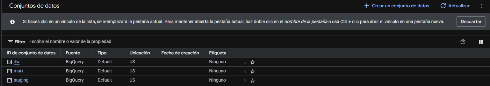{#fig-conjuntos width="75%" fig-align="center"}

## Implementación de Staging

El dataset `staging` funciona como zona de recepción de los datos. Se utilizaron muestras de los archivos institucionales para verificar que BigQuery pudiera importar sus columnas y reconocer sus tipos de datos. Las tablas se mantuvieron identificables por fuente y año, sin ejecutar aún la transformación necesaria para integrarlas al esquema estrella.

Las capturas de esta sección corresponden a la pestaña **Esquema** de BigQuery; permiten observar campos y tipos. 

### DGIS: archivos de afecciones

Los archivos de afecciones contienen diagnósticos asociados a los registros hospitalarios. En el ejemplo de `Afecciones_muestra_12` se distinguen tres columnas:

| Campo observado | Tipo en BigQuery | Descripción para la integración futura |
|:--|:--|:--|
| `ID` | `INTEGER` | Identificador con el que se puede relacionar la afección con el registro correspondiente, sujeto a validación por año. |
| `AFEC` | `STRING` | Código de afección o diagnóstico. |
| `NUMAFEC` | `INTEGER` | Campo numérico de la fuente asociado al registro de afección. Su interpretación precisa debe revisarse en el descriptor. |

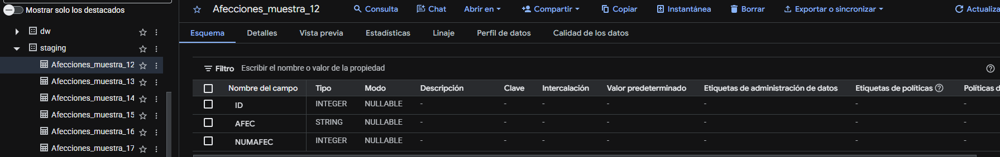{#fig-staging-afecciones width="100%" fig-align="center"}

### DGIS: egresos hospitalarios

Las muestras resumidas de egresos contienen información sobre el evento hospitalario. En `Egreso_muestra_12` se observan, entre otros campos, `ID`, `CLUES`, `EGRESO`, `INGRE`, `DIAS_ESTA`, `EDAD`, `SEXO`, `ENTIDAD` y `MUNIC`.

Estas columnas hacen posible plantear una integración futura por periodo, características demográficas, ubicación y estancia hospitalaria. Sin embargo, **no se transformaron ni homologaron** los códigos al cargar la muestra.

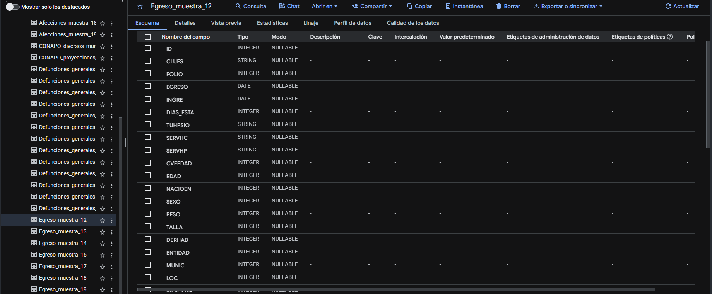{#fig-staging-egreso width="100%" fig-align="center"}

### INEGI: defunciones registradas

Los archivos de defunciones permiten identificar el evento de mortalidad, la causa básica y atributos de residencia y tiempo. En la captura de `Defunciones_generales_19` se observan campos como `ent_resid`, `mun_resid`, `causa_def`, `sexo`, `edad`, `anio_ocur` y `anio_regis`, entre otros.


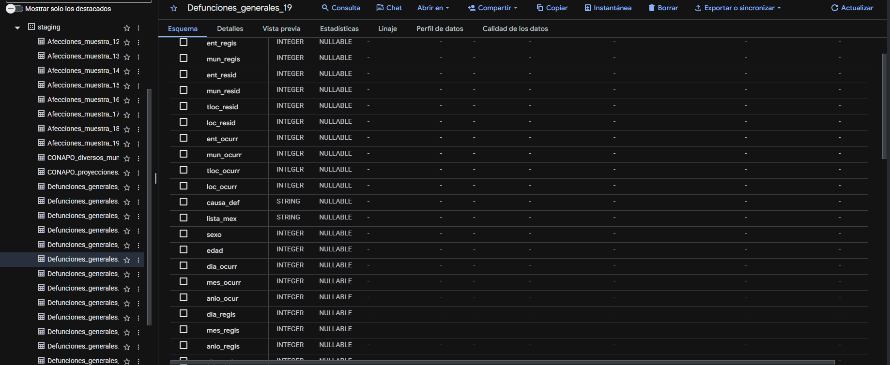{#fig-staging-defunciones width="100%" fig-align="center"}

### CONAPO: población e indicadores demográficos

Se incorporaron datos de CONAPO relativos a proyecciones de población e indicadores municipales. Esta fuente complementa los eventos observados en DGIS e INEGI, pues permitirá construir medidas relativas a la población, como tasas por cada 100,000 habitantes.

Los archivos de CONAPO procedían de hojas de cálculo y se prepararon en un formato que BigQuery pudiera importar. La **compatibilidad de años, grupos de edad, sexo y claves de municipio** deberá resolverse en el ETL.

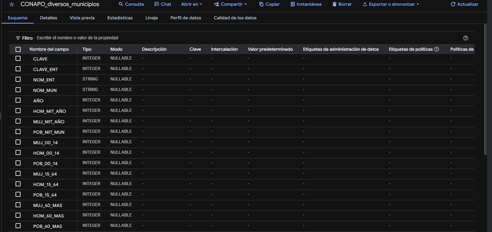{#fig-historial width="100%" fig-align="center"}

### Trabajos de carga e historial

El explorador de trabajos permite consultar el estado de ejecuciones del proyecto, así como identificar trabajos completados y trabajos con error. La siguiente imagen presenta una vista general del historial.

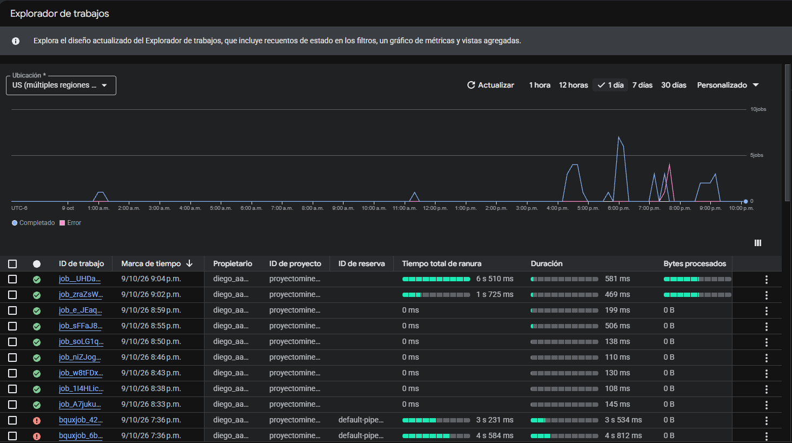{#fig-historial width="100%" fig-align="center"}

**Alcance de esta evidencia:** la captura identifica el historial de trabajos, van incluidos cargas de datos y consultas sql. Los picos de 4:00pm a 8:00 pm representan donde se experimentaron más cargas de datos.

## Implementación del Data Warehouse (DW)

En el dataset `dw` se implementó el esquema estrella propuesto por el equipo, con **cinco dimensiones y dos tablas de hechos**. Las tablas fueron creadas mediante SQL y se encuentran vacías intencionalmente, pues el proceso de extracción, transformación y carga (ETL) queda fuera del alcance de E1.

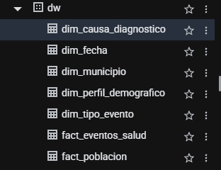{#fig-dw-lista width="70%" fig-align="center"}

| Tipo | Tabla | Campos visibles | Función principal |
|:--|:--|--:|:--|
| Dimensión | `dim_fecha` | 4 | Año y límites del periodo. |
| Dimensión | `dim_municipio` | 10 | Identidad geográfica y vigencia territorial. |
| Dimensión | `dim_causa_diagnostico` | 6 | Categorías y capítulos CIE-10. |
| Dimensión | `dim_perfil_demografico` | 6 | Sexo y grupos de edad. |
| Dimensión | `dim_tipo_evento` | 5 | Distinción entre egreso y defunción. |
| Hechos | `fact_eventos_salud` | 10 | Conteos y medidas de eventos de salud. |
| Hechos | `fact_poblacion` | 5 | Población estimada por periodo y perfil. |

### Evidencia de las cinco dimensiones

Las siguientes capturas muestran directamente los esquemas construidos en BigQuery. En todas las dimensiones se observa la columna correspondiente a la **llave primaria (PK)**.

::: {.panel-tabset}

#### `dim_fecha`

Contiene `fecha_sk`, `anio`, `inicio_periodo` y `fin_periodo`. La llave `fecha_sk` aparece marcada como **PK**.

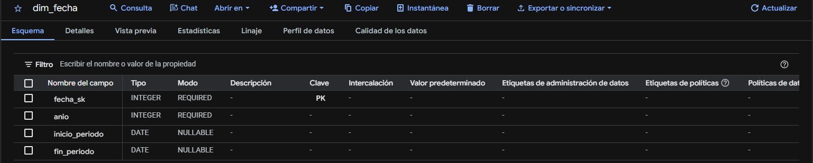{#fig-dim-fecha width="100%" fig-align="center"}

#### `dim_municipio`

Incluye la llave `municipio_sk`, los códigos y nombres geográficos, así como `version_territorial`, `vigencia_desde`, `vigencia_hasta` y `es_actual`, previstos para gestionar el historial territorial.

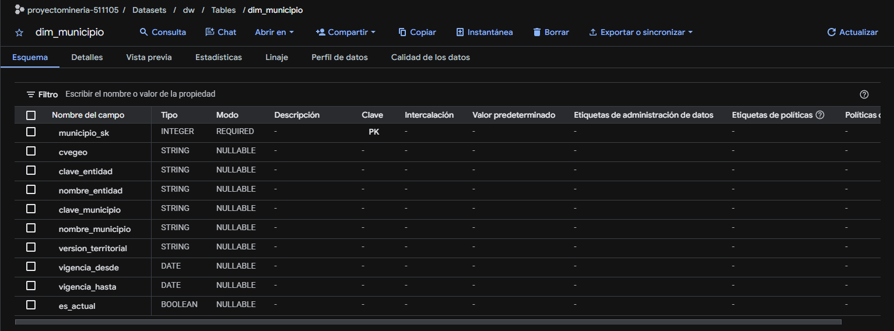{#fig-dim-municipio width="100%" fig-align="center"}

#### `dim_causa_diagnostico`

Incluye la llave `causa_diagnostico_sk`, la categoría CIE-10, su descripción, el capítulo, la descripción del capítulo y la versión del catálogo.

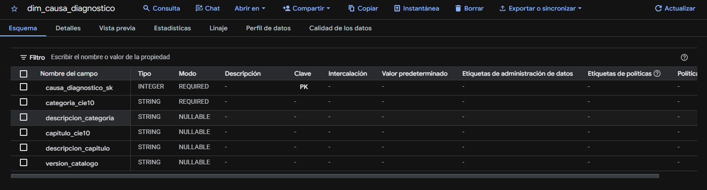{#fig-dim-causa width="100%" fig-align="center"}

#### `dim_perfil_demografico`

Contiene `perfil_demografico_sk`, `sexo`, `codigo_grupo_edad`, `grupo_edad`, `edad_minima` y `edad_maxima`.

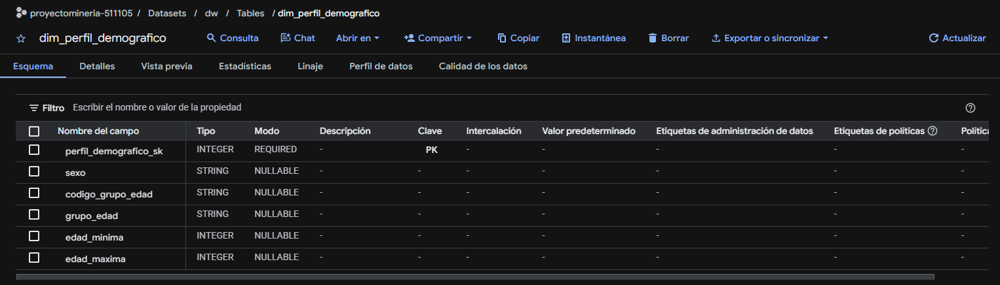{#fig-dim-perfil width="100%" fig-align="center"}

#### `dim_tipo_evento`

Contiene `tipo_evento_sk`, `codigo_tipo`, `nombre_tipo`, `fuente` e `interpretacion_causa`, para distinguir tipos de eventos que tienen significados estadísticos diferentes.

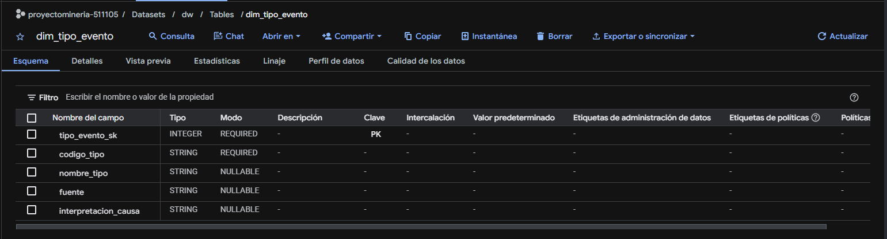{#fig-dim-tipo width="100%" fig-align="center"}

:::

### Evidencia de las dos tablas de hechos

Las tablas de hechos incluyen llaves sustitutas propias, referencias a dimensiones y medidas numéricas. Las capturas de BigQuery señalan las llaves primarias como **PK** y las foráneas como **FK**.

::: {.panel-tabset}

#### `fact_eventos_salud`

La tabla contiene una llave primaria (`evento_salud_sk`), cinco llaves foráneas y cuatro medidas: `conteo_eventos`, `dias_estancia_total`, `egresos_estancia_valida` y `egresos_por_defuncion`.

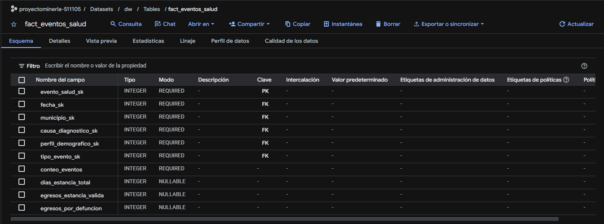{#fig-fact-eventos width="100%" fig-align="center"}

#### `fact_poblacion`

La tabla contiene una llave primaria (`poblacion_sk`), tres llaves foráneas compartidas con el modelo de eventos y la medida `poblacion_estimada`.

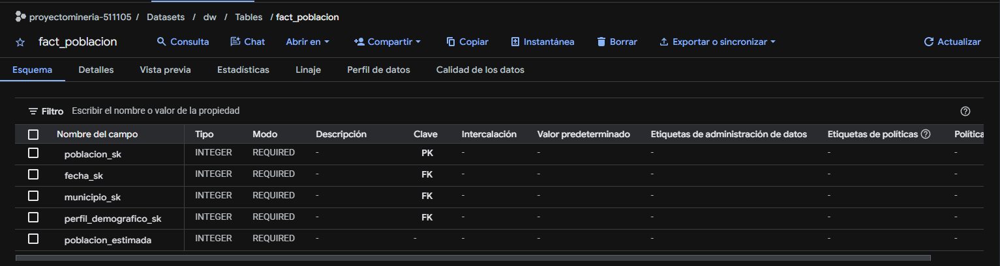{#fig-fact-poblacion width="100%" fig-align="center"}

:::

### Relaciones y reproducibilidad mediante DDL

Las tablas de hechos comparten las dimensiones `dim_fecha`, `dim_municipio` y `dim_perfil_demografico`. Además, `fact_eventos_salud` utiliza `dim_causa_diagnostico` y `dim_tipo_evento`. Esto permite comparar los eventos con la población **al agregar ambas fuentes a un grano compatible**, sin atribuir causas de enfermedad a los registros de población.

El diseño se implementó con sentencias `CREATE TABLE` y declaraciones de llaves primarias y foráneas. En BigQuery, las restricciones declaradas como `NOT ENFORCED` documentan las relaciones, pero **no garantizan automáticamente** la unicidad ni la integridad referencial. Dichas verificaciones deberán incorporarse al futuro proceso ETL.

El código de creación se conserva en [`sql/ddl_dw.sql`](sql/ddl_dw.sql).


## Capa DataMart

El DataMart se plantea como la capa de consultas analíticas sobre el esquema estrella. Las consultas serán desarrolladas y documentadas por el integrante responsable, utilizando el diseño ya implementado en `dw`.

| Pregunta de E0 | Análisis previsto |
|:--|:--|
| **P1. ¿Cuáles son las enfermedades y/o padecimientos a nivel municipal?** | Analizar por separado los conteos de egresos por diagnóstico y defunciones por causa, agrupados por municipio y año. |
| **P2. ¿Qué nos dicen los indicadores acerca de la población del municipio?** | Examinar características y distribución poblacional usando CONAPO y sus dimensiones compatibles. |
| **P3. ¿Qué relación existe entre los indicadores y las enfermedades?** | Relacionar eventos agregados con medidas poblacionales compatibles, distinguiendo asociaciones descriptivas de explicaciones causales. |

La práctica requiere consultas SQL válidas para las preguntas de E0, así como al menos una operación OLAP (por ejemplo, `ROLLUP`, `GROUPING SETS` o funciones de ventana). 

## Limitaciones y verificaciones pendientes

1. **Muestras de carga:** se utilizaron muestras operativas para comprobar la lectura de archivos y sus esquemas; no deben interpretarse automáticamente como representativas de la población nacional cuando proceden de las primeras filas del archivo.
2. **Cobertura temporal:** el análisis principal de eventos se limitó a 2012–2019. Los periodos cubiertos por CONAPO deben alinearse antes de elaborar indicadores comparables.
3. **Granos distintos:** los egresos, sus afecciones, las defunciones y la población no representan la misma unidad de observación. El ETL deberá resolver las relaciones entre archivos, la agregación de categorías y el riesgo de duplicación.
4. **Compatibilidad de códigos:** deberán homologarse claves municipales, sexo, grupos de edad y categorías CIE-10 antes de integrar las tablas.

## Conclusión

Se implementó la base del almacén de datos en BigQuery mediante la carga de muestras de DGIS, INEGI y CONAPO en `staging` y la creación de **siete tablas estructuradas** en el dataset `dw`. Las capturas del esquema acreditan la existencia de las cinco dimensiones y dos tablas de hechos, con sus atributos y llaves declaradas.

Esta arquitectura permite continuar con la homologación e integración de fuentes durante una entrega posterior. 
