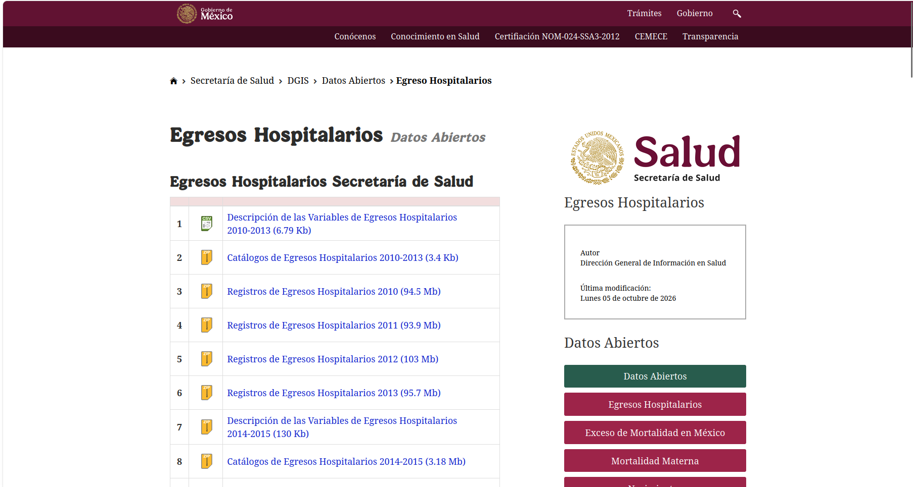
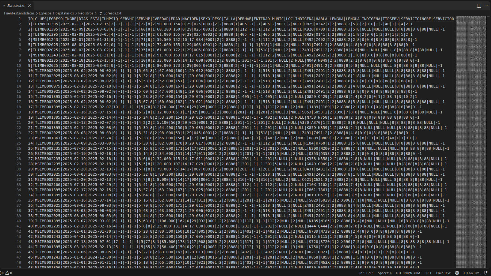
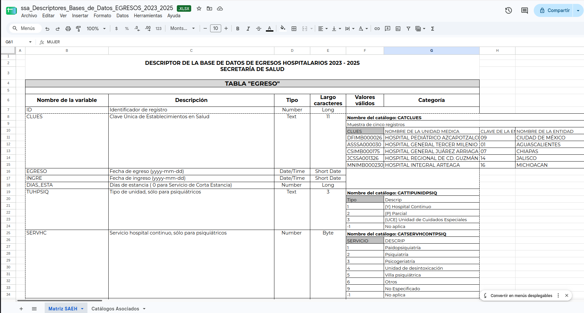
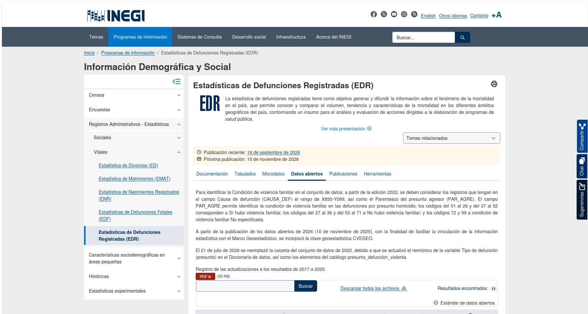
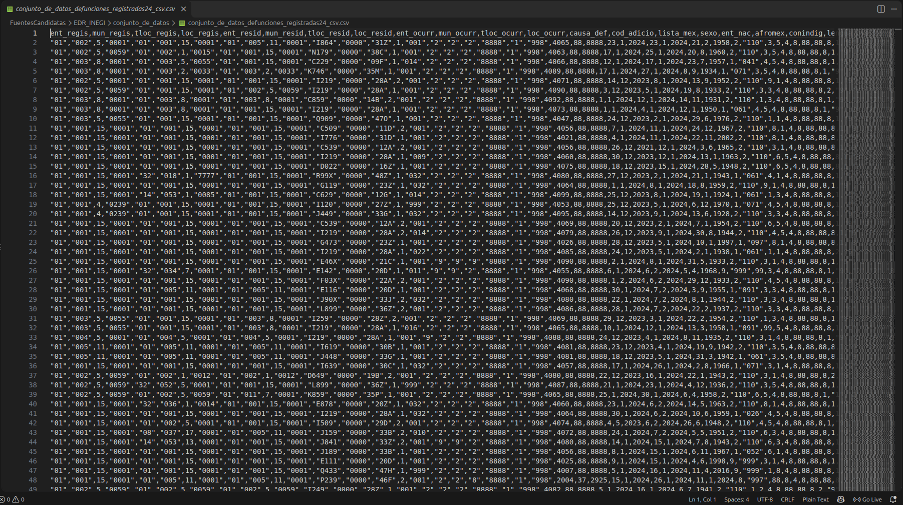
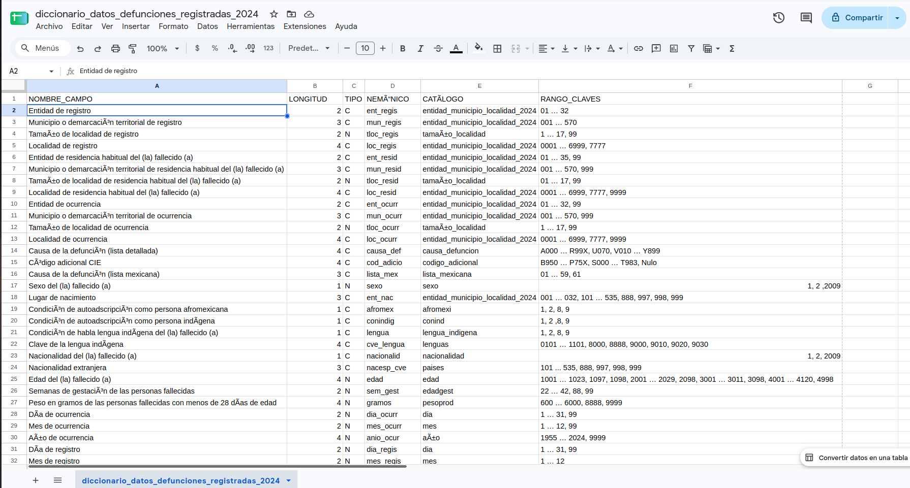
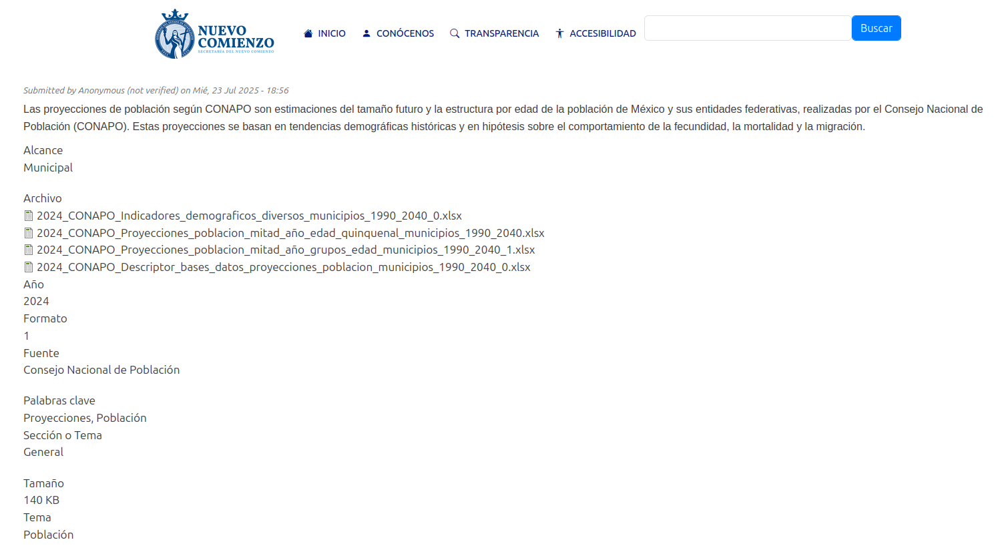
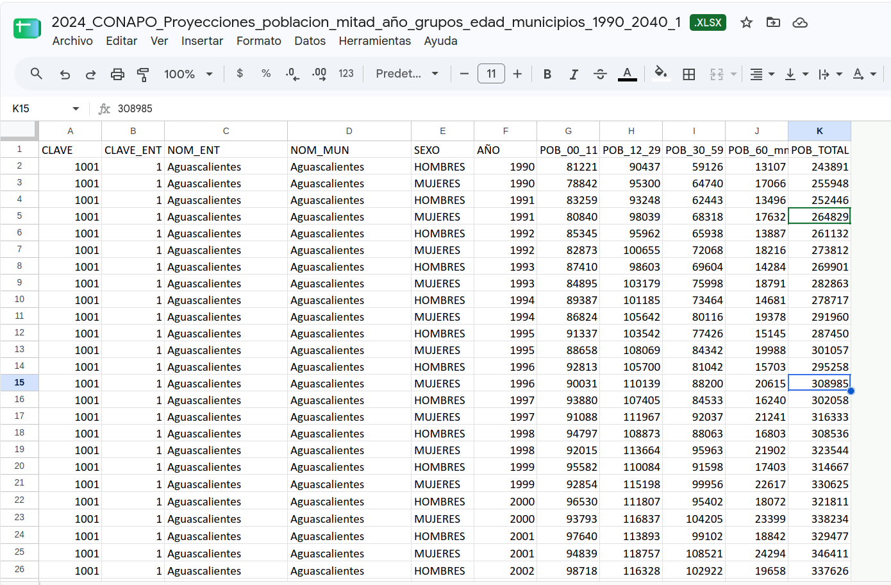
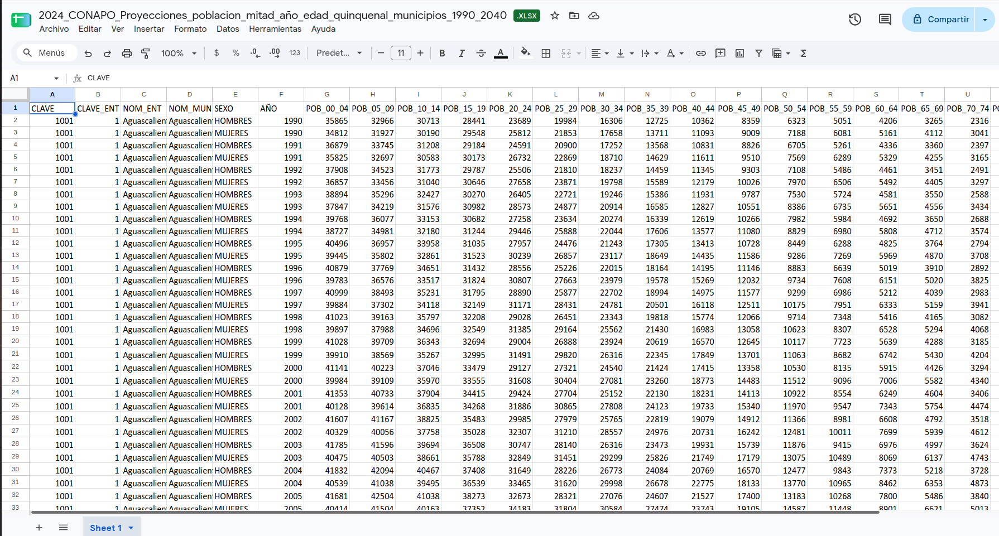

# Preguntas de investigación de E0

Para esta entrega se asignaron identificadores a las preguntas de investigación
priorizadas en E0, con el fin de mantener la trazabilidad entre las preguntas,
las fuentes de datos y el diseño posterior del almacén de datos.

**P1 = ¿Cuáles son las enfermedades y/o padecimientos a nivel municipal?**

La respuesta a ésta pregunta evidentemente vendrá acompañada de estadísticas para que el usuario final, que se espera que posee formación médica, pueda sacar sus conclusiones con base a la información que se le proporcione.

**P2 = ¿Qué nos dicen los indicadores acerca de la población del municipio?**

Los índices de: mortalidad, morbilidad, natalidad, entre otros; son bastante útiles para que el usuario pueda darse una idea acerca del contexto en el que vive la población de su municipio su día a día.

**P3 = ¿Qué relación existe entre los indicadores y las enfermedades?**

Tanto en la medicina como en la ciencia de datos el objetivo principal es buscar patrones y/o relaciones con base a la información que tengamos, por lo tanto, se busca que el usuario pueda obetener la información de una manera sencilla y eficaz para que, como menciona la Dra. Durán, pueda hacer un “pequeño diagnóstico” de la población.

# Requisitos de datos derivados de las preguntas

Entonces los requisitos que se necesitan para cada pregunta serian los siguientes:

| Pregunta | Información requerida |
|---|---|
| P1 | Enfermedad o padecimiento, número de casos o eventos, municipio, entidad federativa y periodo. Cuando sea posible, también sexo y grupo de edad |
| P2 | Población municipal e indicadores como mortalidad, morbilidad, natalidad u otros disponibles |
| P3 | Información que permita relacionar enfermedades e indicadores mediante atributos comunes como municipio y periodo |

De forma general, durante la búsqueda se dará prioridad a fuentes que incluyan
alguno de los siguientes atributos:

- Clave de entidad federativa
- Clave de municipio
- Nombre de entidad y municipio
- Año o periodo de referencia
- Enfermedad, padecimiento, diagnóstico o causa
- Código de clasificación de enfermedad
- Número de casos, egresos o defunciones
- Población
- Sexo
- Grupo de edad

# Criterios de selección

Las fuentes candidatas se evaluarán considerando los siguientes criterios:

1. **Variables de las preguntas:** la fuente debe contribuir a responder al menos una de las preguntas P1, P2 o P3.

2. **Granularidad geografica:** se dará prioridad a fuentes con información a nivel municipal, ya que es un requisito para mejorar la presicion de los datos.

3. **Cobertura historica:** se buscarán fuentes con información histórica que permita estudiar la evolución de enfermedades e indicadores.

4. **Posibilidad de integración:** se favorecerán fuentes que incluyan claves geograficas, periodo u otros identificadores que permitan relacionarlas con otros conjuntos de datos.

5. **Confiabilidad:** se dará prioridad a datos provenientes de instituciones oficiales o fuentes verificables.

6. **Diversidad en la información:** se buscará que las fuentes seleccionadas aporten información diferente y complementaria.

# Proceso de búsqueda de fuentes

La búsqueda de fuentes se realizó utilizando herramientas de investigación asistida por IA y busqueda directa en portales institucionales que nos recomendo la Doctora durante la entrevista.

Todas las fuentes propuestas fueron evaluadas por el equipo para revisar que cumplan los criterios y que sirvan para contestar a las preguntas ante todo.

Se consulto la pagina de Datos Abierto de la Direccion General de Informacion de Salud, ya que nuestra Stackholder nos recomendo esta institucion para tomar los datos, ya que cuentan con distintos tipos de bases de datos, pero de estas las que mas nos sirven son la de "Egresos Hospitalarios" y "Defunciones". Despues de investigar en esta fuente, hicimos una consulta a la IA de Chatgpt sobre opciones de fuentes para obtener los datos que necesitamos. Solo lo ocupamos para que nos diera ideas de donde podiamos encontrar estos tipos de datos, las verificaciones las hicimos nosotros revisando que cumplan los criterios y que sirvan para contestar las preguntas.
**El prompt utilizado fue:** "Busca 8 fuentes oficiales de información sobre enfermedades e índices de salud como morbilidad, mortalidad y otros, que tengan granularidad municipal en México"
Nos regreso 8 opciones de fuentes, todas de las 3 mismas instituciones Secretaria de Salud, INEGI y CONAPO. Pero de estas solo tomamos 3 para ponerlas como candidatas, pues las demas las descartamos porque no estaban centradas en responder las preguntas, y las 5 que pusimos si tenian mayormente cumplimiento en estas.
Entonces de la IA tomamos la de Estadisticas de Defunciones Registradas, Registro de Enfermedades Cronicas en Adultos y la de Problacion de CONAPO.

## Herramientas y portales utilizados

- ChatGPT
- INEGI
- CONAPO
- Datos Abiertos de la Direccion General de Informacion en Salud
- Secretaria de Salud

# Fuentes candidatas evaluadas

| Fuente | Fuente | Institución responsable | P1 | P2 | P3 |
|---|---|---|---|---|---|
| F1 | Egresos Hospitalarios | Secretaria de Salud | ✅ | 🟨 | ✅ |
| F2 | Estadísticas de Defunciones Registradas | INEGI | ✅ | ✅ | ✅ |
| F3 | Registro de enfermedades crónicas en adultos | Secretaria de Salud | ✅ | 🟨 | ✅ |
| F4 | Reconstrucción y proyecciones de la población de los municipios de México 1990-2040 | CONAPO | ❎ | ✅ | ✅ |
| F5 | Defunciones | Secretaria de Salud | ✅ | ✅ | ✅ |

# Selección de fuentes

Después de evaluar las cinco fuentes candidatas, se seleccionaron tres fuentes
para formar parte de la arquitectura del Data Warehouse:

1. **F1 — Egresos Hospitalarios de la Secretaría de Salud**
2. **F2 — Estadísticas de Defunciones Registradas de INEGI**
3. **F4 — Reconstrucción y proyecciones de la población de los municipios de México 1990-2040 de CONAPO**

La selección se realizó buscando que las fuentes fueran complementarias entre sí
y permitieran construir un panorama de salud a nivel municipal.

La fuente de Egresos Hospitalarios proporciona información sobre los eventos de hospitalización y las afecciones principales asociadas a dichos egresos. Las Estadísticas de Defunciones Registradas permiten analizar la mortalidad y sus causas mediante la clasificación CIE-10. Y las proyecciones de población municipal de CONAPO proporcionan la información poblacional necesaria para contextualizar los conteos y calcular indicadores y tasas.

En conjunto, las tres fuentes permiten analizar la frecuencia de determinados padecimientos en los egresos hospitalarios, las principales causas de mortalidad y su relación con el tamaño y características de la población municipal.

# Fuentes descartadas

### F3 — Registro de enfermedades crónicas en adultos

La fuente F3 no fue seleccionada debido a que su alcance es más específico que el requerido para las preguntas planteadas en E0. Esta base se enfoca en enfermedades crónicas no transmisibles en población adulta y adulta mayor que se encuentra en seguimiento dentro de unidades de salud.

Aunque puede aportar información útil para identificar ciertos padecimientos a nivel municipal, no permite representar de manera amplia los diferentes tipos de enfermedades que pueden presentarse en la población. Ni abarca un amplio grupo de personas. En comparación, la fuente F1 de Egresos Hospitalarios contiene información sobre una mayor variedad de diagnósticos y padecimientos asociados a hospitalizaciones.

### F5 — Registro de defunciones de la Secretaría de Salud

La fuente F5 no fue seleccionada principalmente porque existe una alta
redundancia con F2, Estadísticas de Defunciones Registradas de INEGI. Ambas
fuentes permiten analizar defunciones, causas de muerte y características
demográficas y geográficas de las personas fallecidas.

Mantener ambas fuentes aportaría información muy similar para las preguntas y aumentaría la complejidad de integración sin incorporar una dimensión sustancialmente distinta al análisis.

Se decidió conservar F2 porque cumple el papel necesario para estudiar mortalidad, causas de defunción y su distribución municipal, por lo que F5 fue descartada para evitar duplicar una fuente con una función prácticamente equivalente solo de otra institucion.

# Catálogo de fuentes seleccionadas

## F1. Egresos Hospitalarios

| Campo | Información |
|---|---|
| Nombre y dueño | **Egresos Hospitalarios de la Secretaría de Salud.** Dirección General de Información en Salud |
| URL y acceso | Página de bases de datos de la DGIS. Descarga de bases de egresos hospitalarios. (http://www.dgis.salud.gob.mx/contenidos/basesdedatos/da_egresoshosp_gobmx.html)
| Formato y tamaño | Bases de datos distribuidas por año. Dependiendo del periodo existen archivos CSV y paquetes ZIP, acompañados por catálogos y descriptores de campos. El tamaño varía según el año.|
| Grano | Una fila por egreso hospitalario de un paciente. Cada registro representa un evento de egreso e incluye variables del paciente, atención, diagnóstico y lugar |
| Cobertura | Cobertura nacional de unidades médicas hospitalarias de la Secretaría de Salud. Abarca **2010–2026**, hasta 2025 completo y 2026 con informacion preliminar. |
| Licencia y restricciones | Información pública disponible como datos abiertos.|
| Llaves de integración | **Entidad de residencia + municipio de residencia + año**. Adicionalmente, CLUES permite identificar la unidad médica y el Diag_Ini/CIE permite relacionar padecimientos con catalogos de enfermedades |
| **Pregunta(s) de E0** | **P1 — Si.** Permite identificar qué padecimientos aparecen con mayor frecuencia como afección principal de los egresos hospitalarios por municipio; debe aclararse que representa morbilidad hospitalaria, no todos los enfermos de la población. **P2 — Parcial.** Permite obtener indicadores como numero de egresos, días de estancia o características de los pacientes, pero por sí sola no describe a toda la población municipal ni proporciona el denominador poblacional necesario para calcular tasas. **P3 — Sí.** Los egresos y diagnósticos pueden relacionarse con edad, sexo y otros datos del evento y, mediante municipio y año, combinarse con población o mortalidad de otras fuentes para analizar la relación entre enfermedades e indicadores. |

### Evidencia de verificación

**Página oficial de la fuente:**

**Vista previa o apertura de los datos:**

**Descriptor de los datos:**

## F2. Estadísticas de Defunciones Registradas

| Campo | Información |
|---|---|
| **Nombre y dueño** | **Estadísticas de Defunciones Registradas (EDR)**. Instituto Nacional de Estadística y Geografía (INEGI) |
| **URL y acceso** | Consulta y descarga de datos abiertos, metadatos, catálogos y documentación desde INEGI. (https://www.inegi.org.mx/programas/edr/#datos_abiertos) |
| **Formato y tamaño** | Archivos CSV descargables por año que contienen los registros de las defunciones y se acompañan de un diccionario de datos y catálogos que permiten interpretar los códigos utilizados. El tamaño del archivo tambien cambia segun el año |
| **Grano** | Una fila por defunción registrada. |
| **Cobertura** | Cobertura nacional, con información anual (2012-2024) y desglose geográfico que permite identificar la entidad y municipio relacionados con la defunción.|
| **Licencia y restricciones** | Sujeta a los Términos de Libre Uso de la Información del INEGI. Puede copiarse, difundirse, adaptarse y extraerse siempre que se otorgue el crédito correspondiente a INEGI. |
| **Llaves de integración** | Para este proyecto se propone utilizar ENT_RESID,MUN_RESID y ANIO_OCUR. La variable CAUSA_DEF proporciona la causa básica de defunción|
| **Pregunta(s) de E0** | **P1 — Sí.** Permite identificar qué enfermedades, padecimientos o causas de muerte tienen mayor presencia entre las defunciones de residentes de un municipio mediante CAUSA_DEF y CIE-10. Mide enfermedades asociadas a mortalidad. **P2 — Sí.** La mortalidad es uno de los indicadores de salud planteados en el proyecto; permite obtener número de defunciones **P3 — Sí.** Permite relacionar las causas de muerte con edad, sexo, municipio y otras características, además de integrarse con CONAPO para estudiar tasas de mortalidad y compararlas con los padecimientos observados en egresos hospitalarios. |

### Evidencia de verificación

**Página oficial de la fuente:**

**Vista previa o apertura de los datos:**

**Diccionario de los datos:**

## F4. Reconstrucción y proyecciones de la población de los municipios de México 1990–2040

| Campo | Información |
|---|---|
| **Nombre y dueño** | **Reconstrucción y proyecciones de la población de los municipios de México 1990–2040**. Consejo Nacional de Población (CONAPO). |
| **URL y acceso** | La documentación oficial se encuentra en CONAPO, pero por errores en la pagina oficial se encuentra una copia en la pagina del Gobierno de Guanajuato. (https://portalsocial.guanajuato.gob.mx/es/node/3565) |
| **Formato y tamaño** | Archivos de Excel (XLSX). CONAPO organiza las bases en archivos de población por sexo y grupos quinquenales de edad, grandes grupos de edad, indicadores demograficos y diccionario de datos. Tiene aprox mas de 250,000 registros |
| **Grano** | Una fila por municipio, año y sexo. Los distintos grupos quinquenales de edad se representan mediante columnas separadas dentro de cada registro | |
| **Cobertura** | 2,475 municipios desde 1990 hasta 2040. Los valores de 1990–2020 corresponden a una reconstrucción demografica; 2021–2040 son proyecciones. Incluye sexo, edad y diversos indicadores demograficos. |
| **Licencia y restricciones** | Pide citar a SGCONAPO en caso de usar la informacion|
| **Llaves de integración** | Clave de entidad, clave de municipio y año. Para análisis por sexo puede añadirse la categoría de sexo |
| **Pregunta(s) de E0** | **P1 — No.** La fuente no contiene enfermedades, diagnósticos ni casos de padecimientos, por lo que por sí sola no puede determinar cuales enfermedades predominan. **P2 — Sí.** Es una de las fuentes más importantes para esta pregunta porque proporciona población municipal, distribución por sexo y edad e indicadores demograficos que describen la estructura de la población. **P3 — Sí.** Permite contextualizar los casos, egresos y defunciones según el tamaño y composición poblacional. Al integrarla con las otras fuentes se pueden calcular tasas de egresos o mortalidad por cada 100,000 habitantes y analizar cómo se relacionan las enfermedades con las características demograficas del municipio. |

### Evidencia de verificación

**Página oficial de la fuente:**

**Página con copia de los datos que funciona del gobierno de Guanajuato:**

**Vista previa o apertura de los datos:**

**Datos por edad quinquenal:**

# Diversidad de tipos de fuente

Las fuentes seleccionadas corresponden a más de un tipo de fuente.

- **F1 — Egresos Hospitalarios:** base institucional de la Secretaría de Salud / DGIS
- **F2 — Estadísticas de Defunciones Registradas:** archivos de datos abiertos publicados por INEGI
- **F4 — Proyecciones de población municipal:** base institucional elaborada por CONAPO y distribuida en archivos xlsx

Por lo tanto, el proyecto incluye tanto bases institucionales como archivos provenientes de portales de datos abiertos.

# Análisis de integración

Las tres fuentes seleccionadas contienen información con diferentes niveles de detalle por lo que se realizara la integracion usando dimensiones en comun, principalmente la ubicación geográfica (municipal/entidad) y el tiempo.

## Integración geografica

Las tres fuentes permiten identificar el municipio al que pertenece la información, por lo que la principal llave de integración geográfica será una **clave de municipio**, construida a partir de la clave de entidad y la clave municipal.

En F1, Egresos Hospitalarios, se dispone de información correspondiente a la entidad (Entidad) y municipio (Munic) asociados al egreso. En F2 se utilizarán principalmente ENT_RESID y MUN_RESID, debido a que representan la entidad y municipio de residencia habitual de la persona fallecida. En F4 se dispone de la clave geográfica correspondiente al municipio y la clave_ent a entidad.

Para integrar las fuentes se propone generar una clave municipal común con el formato:

`clave_entidad + clave_municipio`

De esta manera, los registros de las diferentes fuentes podrán relacionarse con
una misma dimensión geografica.

## Integración temporal

El segundo componente de integración será el **año**.

F1 contiene las fechas relacionadas con los eventos hospitalarios (Ingreso y Egreso), F2 contiene
el dia, mes y año de ocurrencia de la defunción (en variables distintas) y F4 contiene directamente el año de la estimación o proyección poblacional.

Debido a que las fuentes no necesariamente cubren exactamente los mismos
periodos, los análisis que involucren las tres deberán limitarse a los años para
los cuales exista información compatible en todas las fuentes utilizadas.

## Diferencias de granularidad

Las fuentes seleccionadas no tienen el mismo nivel de granularidad:

- F1 tiene una fila por evento de egreso hospitalario.
- F2 tiene una fila por defunción registrada.
- F4 tiene una fila por municipio, año y sexo.

Por lo tanto F1 y F2 se tienen que poner por municipio y año, para poderlo relacionar con la poblacion correspondiente de F4.

## Construcción de indicadores

La integración con F4 permitirá transformar algunos conteos absolutos en
indicadores comparables entre municipios.

Por ejemplo, para los egresos hospitalarios podrá calcularse:

$$
\text{Tasa de egresos hospitalarios} =
\frac{\text{Número de egresos hospitalarios de un municipio}}
{\text{Población del municipio}}
\times 100000
$$

Nos da la cantidad de egresos hospotalarios por cada 100,000 habitantes, esto para tener una comparativa entre municipios teniendo en cuenta la gente que lo habita.

Este indicador da egresos, no personas enfermas, ya que una persona puede tener diferentes egresos.

De esta manera tambien podemos tomar indicadores sobre enfermedades en los municipios.

Por ejemplo:

$$
\text{Tasa egresos con enfermedad x} =
\frac{\text{Número de egresos hospitalariosde un municipio con enfermedad x}}
{\text{Población del municipio}}
\times 100000
$$

Tambien se puede tomar para las defunciones con algo como:

$$
\text{Tasa de mortalidad} =
\frac{\text{Número de defunciones en el municipio}}
{\text{Población del municipio}}
\times 100000
$$

Nos da la cantidad de defunciones por cada 100,000 habitantes, esto para tener una comparativa entre municipios teniendo en cuenta la gente que lo habita.

Esto permitirá realizar comparaciones entre municipios con diferentes tamaños de población.

## Problemas de integración anticipados

Durante la integración de las fuentes se anticipan los siguientes problemas:

- **Diferencias en las claves geográficas:** Las claves de entidad y municipio pueden presentarse separadas, combinadas o con distintos tipos de dato. Será necesario homologarlas.

- **Diferencias en la codificación del sexo:** F1 y F2 tienen la categoria de sexo por numero y F4 lo representa como hombres y mujeres, por lo que sera necesario homologar esta categoria

- **Diferencias en la representación de la edad:** F1 y F2 pueden contener la edad de cada registro, mientras que F4 almacena la población en grupos quinquenales de edad. Si se realizan analisis por edad, sera necesario transformar las edades individuales a los mismos grupos utilizados por CONAPO.

- **No juntar egresos y defunciones:** En F1 y F2 se usa el CIE-10, que es una estandarizacion para asignar codigos a problemas en la salud, para asignarlos en la causa del egreso o causa de la defuncion, pero estos se deben analizar por separado ya que aunque se especifiquen tambien defunciones en F1, son distintas a las de F2 y podria servir el usar ambas pero en distntos fines.

- **Diferencia en egresos y enfermedades.** En F1 no se debe tomar como que un egreso significa una persona enferma distinta, ya que puede que una misma persona tenga distintos egresos con una misma enfermedad o distintas enfermedades. Aparte de que no toda la gente enferma va a los hopsitales, por lo que no podemos concluir que sus datos nos dan cantidad de gente con cierta enfermedad, si no cantidad de egresos con dicha enfermedad.